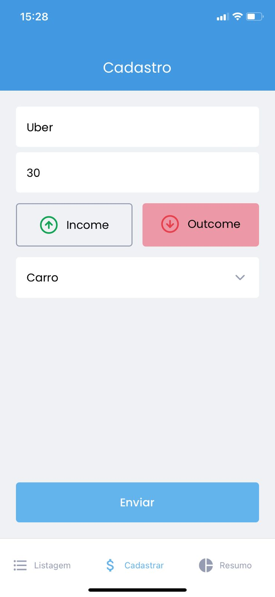
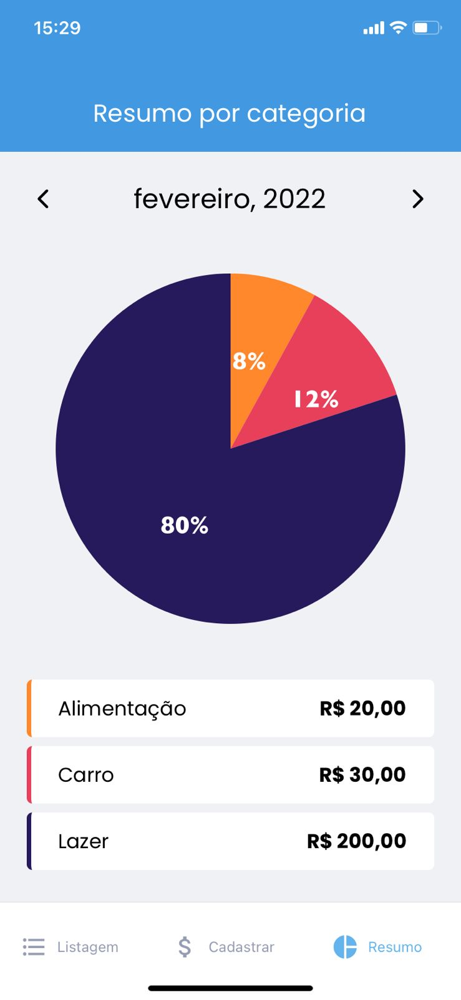

## 🚀 Tecnologias

- React Native
- TypeScript
- [Expo](https://expo.dev/) (framework para rodar os códigos em React Native mais tranquilamente, dispensando a complexidade de parametrização de ambiente que se tem com por exemplo os emuladores Android Studio e Xcode)
  - [AsyncStorage](https://docs.expo.dev/versions/v44.0.0/sdk/async-storage/)
  - [AuthSession](https://docs.expo.dev/versions/latest/sdk/auth-session/)
    - [OAuth 2.0](https://developers.google.com/identity/protocols/oauth2/javascript-implicit-flow) para acessar API do Google
  - [AppleAuthentication](https://docs.expo.dev/versions/v44.0.0/sdk/apple-authentication/)
- [Styled Components](https://styled-components.com/)
- [React Hook Form](https://react-hook-form.com/)
- [React Navigation](https://reactnavigation.org/)

## 💻 Projeto

O GoFinances é uma aplicação de controle financeiro semelhante ao [dtmoney](https://github.com/FelipeBrenner/ignite-reactjs-dtmoney) e [dev.finances](https://github.com/FelipeBrenner/maratona-discover-01-devfinances). Foi desenvolvida durante as aulas do Chapter II da trilha de React Native do Bootcamp Ignite da Rocketseat, e nela é possível cadastrar transações e visualizar em listagem e resumo em gráfico por categoria 💰

  
  
  
  
  

## 🖥️ [Figma](https://www.figma.com/file/vThJ6qrb4HDT6RfO5sJGu0/GoFinances-Ignite?node-id=0%3A1)
