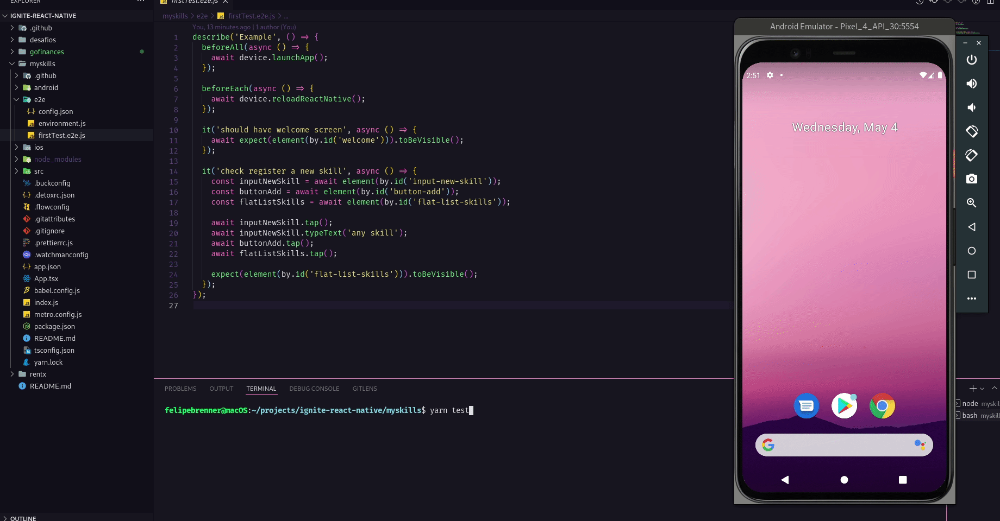

## 🚀 Tecnologias

- React Native
- TypeScript
- Conceitos como componentes, propriedades, estado, imutabilidade, hooks e estilização
- [Detox](https://wix.github.io/Detox/) ([Setup](https://www.notion.so/Detox-Setup-359cdc2888ad4481b4448f737bef637b))

## 💻 Projeto

  

## ⚙️ Teste E2E

  

